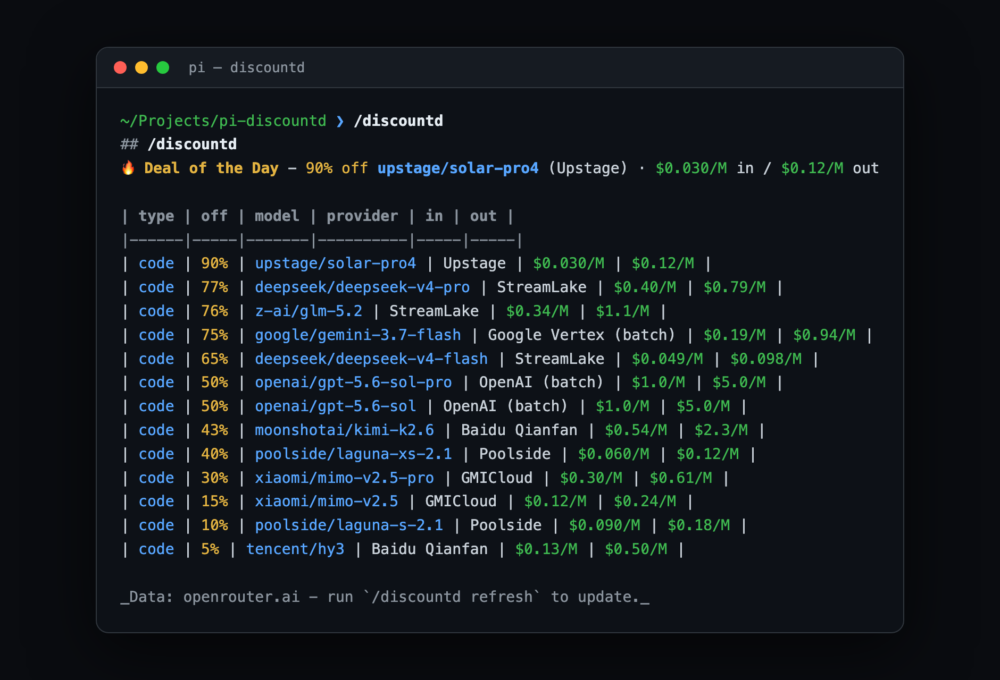

# pi-discountd

🏷️ **The discount daemon for pi - always watching for the next deal.**

<p align="center">
  
</p>

Hot-swap discounted models into your session with one command. `discountd`
reads OpenRouter's live discount feed, pins the **Deal of the Day** at the top,
and lets you pick any model to activate instantly.

## Install

```bash
pi install npm:pi-discountd
```

Requires no API key for the deal listings. Activating OpenRouter-only models
(via `pick`) needs an OpenRouter API key.

## Usage

| Command | What it does |
| --- | --- |
| `/discountd` | 🏷️ Deal of the Day + coding-focused deals |
| `/discountd or` | OpenRouter deals (the default source) |
| `/discountd all` | All discounted models, sorted by discount |
| `/discountd free` | Free models ($0 tokens) |
| `/discountd cheap` | Cheapest paid coding models |
| `/discountd pick` | Pick a model from the deals and activate it |
| `/discountd pick <id>` | Activate a specific deal model by slug |
| `/discountd refresh` | Force-refresh the cache |

## How it works

- Reads OpenRouter's frontend models API (`?discount=true`) - the same
  promotional-discount list behind the "Discounted AI Models" collection.
- Classifies coding models from OpenRouter's per-model "programming" usage
  analytics plus slug/name heuristics.
- Caches locally (deals 6h, full catalog 24h); works offline on stale cache.
- `pick` registers the chosen OpenRouter deal model on the fly and activates it in your session (requires OpenRouter API key or `/login openrouter`).

## Scope

`or` (OpenRouter) is the default - and currently only - source. Future
provider members (`anthropic`, `bedrock`, ...) can slot in behind the same
command as additional sources.

## License

MIT
